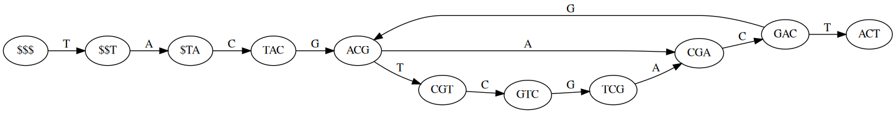

# succint-dbg-rs

Porting in Rust of succint De Bruijn graph from [Alex Bowe](https://alexbowe.com/succinct-debruijn-graphs/)
([Python Code](https://github.com/alexbowe/debby))

Succint rappresentation support:
- forward(i)
- backward(i)
- outdegree(n)
- indegree(n)
- outgoing(n, s)
- incoming(n, s)
- successors(n)
- label(n)
- print of the vectors that represent the dbg
- dot creation

```Rust
    let mut reads = vec!["TACGACGTCGACT".to_string()];
    let sdbg = SDbg::new(&mut reads, 4);
```



## Todo
- [ ] documentation
- [ ] optimizations
- [ ] refactoring
- [ ] more tests
